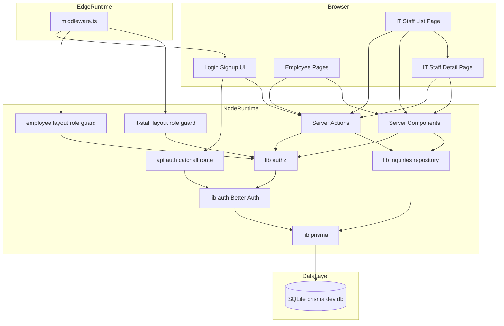
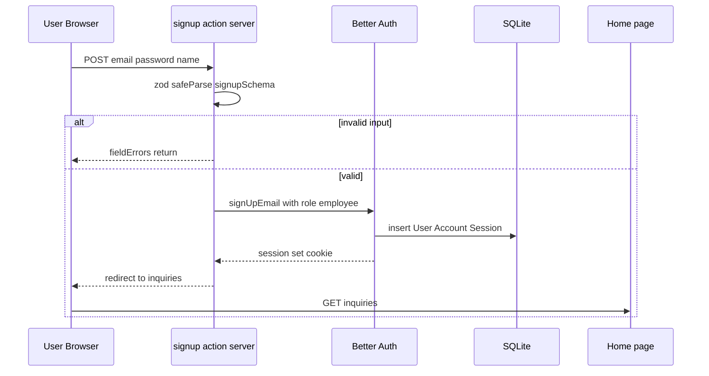
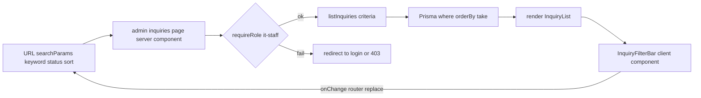
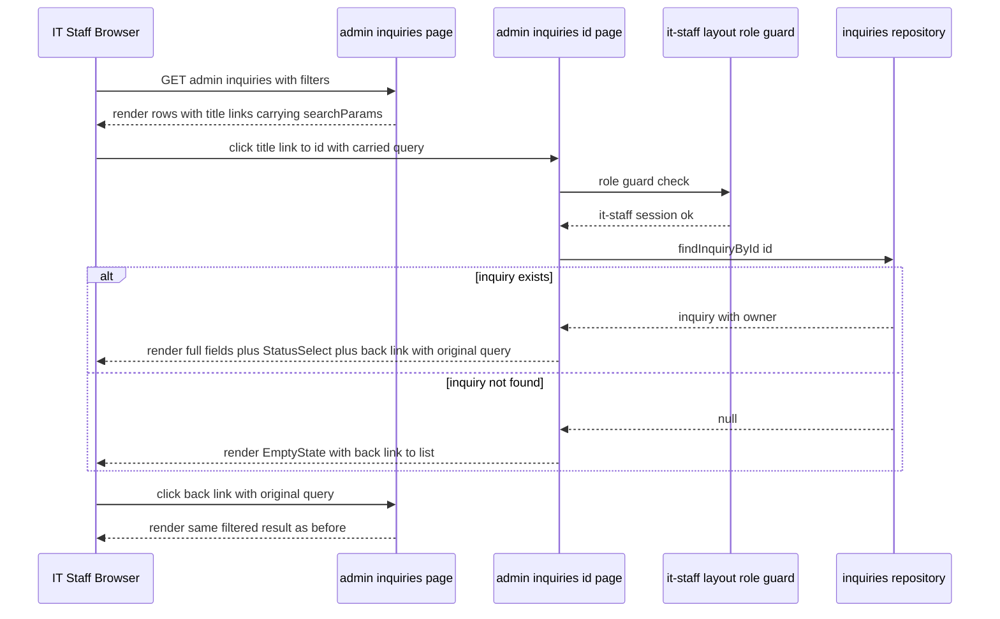
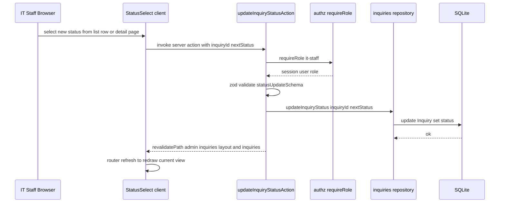
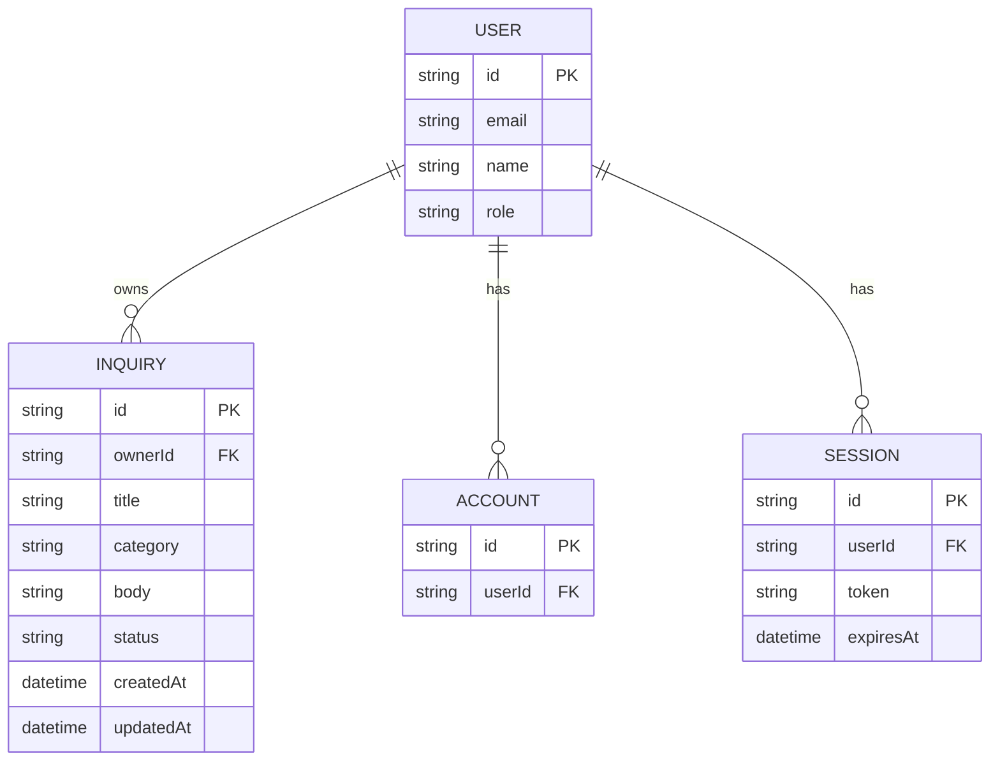

# Design Document — it-inquiry-list

## Overview

**Purpose**: 社内向け IT 問合せの「登録 → 一覧確認 → 詳細閲覧 → ステータス更新」を、ロール（社員 / 情シス担当）に応じた最小限の画面と操作で提供する Web アプリケーションを構築する。
**Users**: 社員（依頼者）と情シス担当者（受付・対応者）の 2 種類。社員は自分の問合せ進捗を、情シス担当は全社の問合せ全体像と各問合せの本文を含む詳細を把握する。
**Impact**: greenfield プロジェクトの最初の機能スペックとして、認証基盤（Better Auth）・データ永続化（Prisma + SQLite）・ロール認可・問合せドメインモデルを土台ごと立ち上げる。情シス担当向けの問合せ詳細画面は、it-staff からのクレーム（一覧から本文を確認できない）を受けて Requirement 7 として追加された拡張領域である。

### Goals

- email + password 認証と 2 ロール認可を Better Auth + Prisma で確立する
- 問合せの登録・一覧表示・ステータス更新を Server Components + Server Actions で実装する
- 全件一覧の検索（タイトル・本文部分一致）・フィルタ（ステータス）・ソート（登録日時）を URL 検索パラメータ駆動で実現する
- 情シス担当向けに、一覧から選択した問合せの全項目（本文を含む）を確認できる詳細画面を提供し、詳細画面からもステータス更新を実行できるようにする
- 後続スペック（通知・SLA・SSO 等）が安全に拡張できる責務境界を確定する

### Non-Goals

- 通知（メール／チャット／Push）、SLA、エスカレーション、自動割当、担当者割当ワークフロー
- 添付ファイル、コメント、回答履歴・差分、監査ログ、操作履歴
- 外部チケットシステム連携（Jira / Zendesk 等）、SSO / MFA / ソーシャルログイン、パスワードリセット、メール検証
- 多テナント、多言語化（日本語 UI のみ）
- SQLite 以外の本番グレード DB 切替（別スペックで扱う）
- **社員（employee）向けの問合せ詳細画面**（社員は自分の一覧での確認に留め、詳細画面は持たない）

## Boundary Commitments

### This Spec Owns

- 認証（email + password のサインアップ／ログイン／ログアウト／セッション管理）。Better Auth を本スペックが導入・配線する。
- ロール認可（`employee` / `it-staff` の 2 値、サーバ側ガード、ミドルウェア＋ Layout の 2 段防御）。
- `Inquiry` ドメインのスキーマ定義・CRUD・ステータス遷移。
- 社員向け「自分の問合せ一覧」、情シス向け「全件一覧 + 検索/フィルタ/ソート」、**情シス向け「問合せ詳細表示」（タイトル / カテゴリ / 本文 / 登録者 / 登録日時 / ステータスの全項目表示と詳細画面からのステータス更新、戻り導線、ID 不正時のエラー表示）** の画面と Server Action。
- カテゴリ／ステータスの固定値集合（English keys + 日本語ラベル分離）。
- Prisma スキーマ・SQLite 接続・初期マイグレーション。

### Out of Boundary

- 通知（メール／Slack／Teams／Push）、Webhook、外部連携。
- 添付ファイル保存・スキャン、ファイルストレージ層。
- 担当者割当・コメント・履歴差分・操作監査ログ。
- パスワードリセット／メール検証／MFA／SSO／ソーシャルログイン。
- 多テナント、多言語、PII マスキング、データ保持ポリシー。
- 本番運用向けの DB 切替（Postgres 等）、バックアップ／レプリケーション。
- レート制限・WAF・侵入検知などプラットフォーム横断のセキュリティ施策。
- **社員（employee）ロール向けの詳細画面**（要件 4.5 により employee は任意の詳細 URL 直アクセスを拒否する）。

### Allowed Dependencies

- 既存スケルトン: Next.js `16.2.4` / React `19.2.4` / TypeScript `5` / Tailwind CSS `4` / Biome `2.2.0`
- 新規導入: `better-auth ^1.6.9`、`@prisma/client` および `prisma` 最新安定版（SQLite サポート版）、`zod`（最新安定版）
- ランタイム: Node.js（Server Components / Server Actions / Middleware の Edge 部分は Cookie 判定のみ）
- DB ファイル: `prisma/dev.db`（開発／本スペックの利用シナリオ）

依存方向（左 → 右、右から左への import 禁止）:

```
types & labels  →  validation (zod)  →  prisma client  →  inquiries/repository  →  authz  →  Server Actions / Server Components / Layout / Middleware  →  UI components
                                                                                             ↑
                                                                                      auth (Better Auth)
```

### Revalidation Triggers

- `Inquiry`／`User` のスキーマ変更（カラム追加・型変更）
- ステータス値集合（`open` / `in_progress` / `done`）またはカテゴリ値集合の変更
- ロール集合の拡張（`employee` / `it-staff` 以外の追加、または 1 ユーザ複数ロール化）
- 認証ライブラリの差替え（Better Auth → Auth.js 等）またはセッション Cookie の互換性破壊
- DB エンジンの切替（SQLite → Postgres 等）または接続戦略の変更
- Server Actions / API Route の公開契約変更（フィールド名、バリデーション規則）
- **詳細画面 URL 構造の変更**（`/admin/inquiries/[id]?keyword=...&status=...&sort=...` 形式の query 持ち回し規約を破ると一覧 → 詳細 → 戻り の状態保持が壊れる）

## Architecture

### Architecture Pattern & Boundary Map

採択パターン: **Next.js 16 App Router + Server Components/Actions + Repository（薄）**。



**Architecture Integration**:

- **Selected pattern**: App Router 標準の Server Components + Server Actions、データアクセスは `lib/inquiries/repository.ts` に集約。
- **Domain/feature boundaries**: 認証ドメイン（`lib/auth.ts` + `app/api/auth/*`）と問合せドメイン（`lib/inquiries/*` + `app/(employee)`／`app/(it-staff)`）を分離。共通の認可ヘルパは `lib/authz.ts` に集める。
- **Existing patterns preserved**: 既存の `app/layout.tsx`、Tailwind 4、Biome の設定はそのまま利用。`@/*` パスエイリアスを継続使用。詳細画面も既存の Server Component + URL 駆動パターンを踏襲。
- **New components rationale**: 詳細画面は `(it-staff)/admin/inquiries/[id]/page.tsx` として Dynamic Segment 配下に配置し、ロールガードを `(it-staff)/layout.tsx` から自動継承する。
- **Steering compliance**: structure.md の「Route Group によるロール別境界 + ドメイン別 lib/components」規約に整合。新たな pattern 導入なし。

### Existing Architecture Analysis

- 現状コードベースは Requirement 1〜6 まで実装済み（`tasks.md` 全タスク `[x]` 完了状態）。`it-staff` 向け全件一覧 (`app/(it-staff)/admin/inquiries/page.tsx`) と `StatusSelect` によるインライン更新は稼働中。
- 詳細表示の基盤は既に揃っている: `findInquiryById` (`lib/inquiries/repository.ts:52-69`)、`updateInquiryStatusAction` (`app/(it-staff)/admin/inquiries/actions.ts`)、`requireRole("it-staff")` (`lib/authz.ts:25-33`)、`StatusBadge` / `StatusSelect` / `CATEGORY_LABELS` / `EmptyState` がすべて再利用可能。
- `(it-staff)/layout.tsx` のロールガードは Dynamic Segment 配下にも自動継承されるため、新規詳細ページに追加の認可コードは不要。
- パスエイリアス `@/*` → `./*` を `tsconfig.json` で定義済み。本スペックでは `@/lib/...`、`@/prisma/...` を多用する。
- Biome v2 が設定済み（`indentStyle: space, indentWidth: 2`）。生成コードはこの規約に従う。
- ランタイムは Bun（`bun.lock` 存在）。スクリプトは `next dev / build / start`、`biome lint`。

### Technology Stack

| Layer | Choice / Version | Role in Feature | Notes |
|-------|------------------|-----------------|-------|
| Frontend | Next.js `16.2.4` / React `19.2.4` / Tailwind CSS `4` | App Router の Server Components で SSR、Tailwind で UI スタイリング、Dynamic Segment `[id]` で詳細ページ | 既存スケルトン踏襲 |
| Auth | `better-auth ^1.6.9` | email + password、セッション、`additionalFields.role` でロール拡張 | CVE-2026-41427 回避のため `>= 1.6.5` 必須、`>= 1.6.9` 推奨 |
| ORM | `prisma` / `@prisma/client`（最新安定版） | スキーマ定義、マイグレーション、Better Auth アダプタ | `prismaAdapter(prisma, { provider: "sqlite" })` |
| DB | SQLite | 開発・社内少人数想定の永続化 | `prisma/dev.db`、`DATABASE_URL=file:./dev.db` |
| Validation | `zod`（最新安定版） | Server Actions の入力検証、エラー構造化 | Better Auth 内部でも Zod 利用、依存重複なし |
| Lint/Format | Biome `2.2.0` | TS/TSX 品質統一 | 既存設定踏襲、追加ルールなし |
| Runtime | Node.js（Server）、Edge（Middleware のみ） | Middleware は Cookie 存在判定のみで Prisma を呼ばない | DB アクセスを伴う認可は Node 側 Layout で実施 |

詳細な選定根拠・代替検討は `research.md` を参照。

## File Structure Plan

### Directory Structure

```
prisma/
├── schema.prisma                         # User Account Session Verification Inquiry の Prisma スキーマ
└── migrations/                           # prisma migrate dev により自動生成
    └── (initial)/migration.sql

lib/
├── prisma.ts                             # Prisma client singleton globalThis cache
├── auth.ts                               # Better Auth サーバインスタンス additionalFields role
├── auth-client.ts                        # createAuthClient クライアント側
├── authz.ts                              # requireUser requireRole ヘルパ Server only
├── validation.ts                         # Zod スキーマ サインアップ ログイン 問合せ ステータス更新
├── format.ts                             # 日時整形ユーティリティ JSX 非依存
└── inquiries/
    ├── types.ts                          # Status Category 列挙 TS const + 型
    ├── labels.ts                         # 日本語ラベル UI からのみ参照
    └── repository.ts                     # listInquiries createInquiry updateInquiryStatus findInquiryById

app/
├── layout.tsx                            # 既存 メタデータ
├── globals.css                           # 既存
├── page.tsx                              # 認証状態に応じてロール別ホームへ redirect
│
├── (auth)/                               # Route Group 公開ルート
│   ├── login/page.tsx                    # ログインフォーム
│   ├── signup/page.tsx                   # サインアップフォーム
│   └── actions.ts                        # signupAction loginAction logoutAction
│
├── (employee)/                           # Route Group 社員ロール限定
│   ├── layout.tsx                        # role guard requireRole employee
│   └── inquiries/
│       ├── page.tsx                      # 自分の問合せ一覧
│       ├── new/page.tsx                  # 問合せ登録フォーム
│       └── actions.ts                    # createInquiryAction
│
├── (it-staff)/                           # Route Group 情シス担当ロール限定
│   ├── layout.tsx                        # role guard requireRole it-staff
│   └── admin/
│       └── inquiries/
│           ├── page.tsx                  # MODIFY 全件一覧 + タイトル列を詳細リンク化、searchParams を持ち回し
│           ├── actions.ts                # MODIFY updateInquiryStatusAction の revalidatePath を 'layout' モードへ切替
│           └── [id]/                     # NEW 詳細表示 Dynamic Segment
│               └── page.tsx              # NEW 問合せ詳細 Server Component（全項目表示 + StatusSelect + 戻り導線 + 不在時 EmptyState）
│
└── api/
    └── auth/[...all]/route.ts            # Better Auth toNextJsHandler

components/
├── auth/
│   ├── AuthForm.tsx
│   └── LogoutButton.tsx
└── inquiries/
    ├── InquiryForm.tsx
    ├── InquiryList.tsx
    ├── InquiryFilterBar.tsx
    ├── StatusBadge.tsx                   # 詳細画面でも再利用
    └── StatusSelect.tsx                  # 詳細画面でも再利用（既存パターン: router.refresh で表示更新）

proxy.ts                                  # プロジェクト直下 Edge ランタイム Cookie 判定（既存）

.env                                      # DATABASE_URL=file:./dev.db BETTER_AUTH_SECRET=... BETTER_AUTH_URL=http://localhost:3000
```

### Modified Files

- `app/(it-staff)/admin/inquiries/page.tsx` — タイトル列を `<Link href="/admin/inquiries/{id}?keyword=...&status=...&sort=...">` に変更し、現在の `searchParams` を query string として持ち回す（要件 7.1、7.6）。`StatusSelect` セルはリンク外に維持し、行内クリックの衝突を回避。
- `app/(it-staff)/admin/inquiries/actions.ts` — `revalidatePath("/admin/inquiries")` を `revalidatePath("/admin/inquiries", "layout")` に変更し、配下の詳細ページも自動 revalidate 対象にする（要件 6.4、7.5）。`/inquiries`（社員側）の revalidate は維持。

### New Files

- `app/(it-staff)/admin/inquiries/[id]/page.tsx` — 問合せ詳細 Server Component。`findInquiryById(params.id)` でデータ取得、`null` 時は `EmptyState` で「対象の問合せが見つかりません」+ 一覧へ戻る導線を表示。表示要素はタイトル（`<h2>`）、カテゴリ（`CATEGORY_LABELS` 参照）、本文（`<div className="whitespace-pre-wrap break-words">`）、登録者（`owner.name`）、登録日時（`toLocaleString("ja-JP")`）、ステータス（`StatusSelect` で変更可能）。戻り導線は `<Link href="/admin/inquiries?keyword=...&status=...&sort=...">` 形式で `searchParams` を復元（要件 7.1〜7.7）。

> 各ファイルは単一責務。詳細ページは `findInquiryById` の戻り値に対する純粋な表示と既存 `StatusSelect` の埋め込みのみを担い、ステータス更新ロジックは既存 Action に委譲する。

## System Flows

### サインアップ → 自動ログイン → ホーム遷移



### 全件一覧の検索／フィルタ／ソート（情シス）



### 一覧 → 詳細表示 → 戻り導線（情シス、要件 7）



### ステータス更新（情シス、一覧と詳細の双方から共通）



詳細画面のステータス変更後は、`router.refresh()` で詳細ページ自身を再描画して新ステータスを反映する（既存 `StatusSelect` の慣行を踏襲、要件 7.5）。`revalidatePath('/admin/inquiries', 'layout')` により一覧および詳細を含む配下が自動 revalidate されるため、別タブで開いている一覧側にも次回アクセスで反映される（要件 6.4）。

## Requirements Traceability

| Requirement | Summary | Components | Interfaces | Flows |
|-------------|---------|------------|------------|-------|
| 1.1 | サインアップで employee ロール付与 | `signupAction`, `auth` | `signUp.email`, `additionalFields.role` | サインアップフロー |
| 1.2 | 既存メール拒否 | `signupAction`, `auth` | Better Auth `USER_ALREADY_EXISTS` | サインアップフロー |
| 1.3 | パスワードポリシー違反拒否 | `signupAction`, `lib/validation.ts` | `signupSchema`, `auth.emailAndPassword.minPasswordLength=8` | サインアップフロー |
| 1.4 | ログイン成立とロール別遷移 | `loginAction`, `app/page.tsx` | `signIn.email`, redirect | サインアップフロー後段 |
| 1.5 | 認証エラーは汎用メッセージ | `loginAction` | `INVALID_EMAIL_OR_PASSWORD` を一括表示 | — |
| 1.6 | ログアウト | `LogoutButton`, `logoutAction` | `signOut` | — |
| 1.7 | 未ログイン時の保護ページ遮断 | `proxy.ts`, `(employee)/layout.tsx`, `(it-staff)/layout.tsx` | Cookie check + `requireUser` | — |
| 2.1 | ユーザに 1 ロール保持 | `prisma/schema.prisma` `User.role` | `additionalFields.role` | — |
| 2.2 | employee は登録・自分の一覧のみ。全件・詳細・更新を拒否 | `(employee)/layout.tsx`, `(it-staff)/layout.tsx` | `requireRole("employee" \| "it-staff")` | — |
| 2.3 | it-staff は全件・詳細・更新を許可 | `(it-staff)/layout.tsx` | `requireRole("it-staff")` | 一覧 → 詳細フロー |
| 2.4 | employee の詳細・更新エンドポイント直叩きを拒否 | `updateInquiryStatusAction`, `(it-staff)/admin/inquiries/[id]/page.tsx`（layout 経由で拒否） | `requireRole("it-staff")` | ステータス更新フロー |
| 2.5 | サーバ側でのロール検証 | `lib/authz.ts` | `requireUser`, `requireRole` | — |
| 3.1 | 登録フォーム表示 | `(employee)/inquiries/new/page.tsx`, `InquiryForm` | — | — |
| 3.2 | カテゴリ固定値 | `lib/inquiries/types.ts`, `labels.ts`, `validation.ts` | `CATEGORY_VALUES`, `inquirySchema` | — |
| 3.3 | 登録 → 永続化 → 通知 | `createInquiryAction`, `repository.createInquiry` | `InquiryRepository.create` | — |
| 3.4 | 入力エラーは項目別表示 + 入力保持 | `InquiryForm`, `createInquiryAction` | `useActionState` + `fieldErrors` | — |
| 3.5 | タイトル 120 / 本文 2000 文字制限 | `lib/validation.ts` | `inquirySchema.title.max(120)`, `body.max(2000)` | — |
| 3.6 | 登録後に自分の一覧に遷移 | `createInquiryAction` | `redirect("/inquiries")` | — |
| 4.1 | 自分の問合せのみ表示 | `(employee)/inquiries/page.tsx`, `repository.listInquiries` | `criteria.ownerId = session.user.id` | — |
| 4.2 | 行に必要項目を表示 | `InquiryList` | props 型 | — |
| 4.3 | 既定ソートは登録日時降順 | `repository.listInquiries` | `orderBy: { createdAt: "desc" }` | — |
| 4.4 | 0 件時のメッセージ + 導線 | `(employee)/inquiries/page.tsx`, `EmptyState` | — | — |
| 4.5 | 社員は任意の詳細 URL 直アクセスを拒否（社員ロールは詳細画面を持たない） | `(employee)/layout.tsx`（`(it-staff)/admin/...` への直叩きは role guard で `(it-staff)/layout.tsx` 側が `FORBIDDEN`） | `requireRole("it-staff")` | — |
| 5.1 | 全件一覧の表示項目 | `(it-staff)/admin/inquiries/page.tsx`, テーブル直書き | — | 全件一覧フロー |
| 5.2 | キーワード検索（タイトル・本文部分一致） | `InquiryFilterBar`, `repository.listInquiries` | `criteria.keyword`, Prisma `contains` | 全件一覧フロー |
| 5.3 | ステータスフィルタ | 同上 | `criteria.status` | 全件一覧フロー |
| 5.4 | 登録日時昇降ソート | 同上 | `criteria.sort = "createdAt_asc" \| "createdAt_desc"` | 全件一覧フロー |
| 5.5 | 検索 + フィルタ + ソートを AND 結合 | `repository.listInquiries` | Prisma `where` 合成 | 全件一覧フロー |
| 5.6 | 0 件時のメッセージ + 解除導線 | `EmptyState`, `InquiryFilterBar` | — | — |
| 5.7 | リロード／別タブで条件再現 | URL `searchParams` を Server Component が直接参照 | URL 駆動 | 全件一覧フロー |
| 6.1 | ステータス 3 値固定 | `lib/inquiries/types.ts`, `validation.ts` | `STATUS_VALUES` | — |
| 6.2 | 初期ステータス open | `repository.createInquiry` | `data.status = "open"` | — |
| 6.3 | it-staff のみ更新可能（一覧・詳細の双方から） | `(it-staff)/admin/inquiries/actions.ts`, `authz.requireRole`, `StatusSelect`（一覧/詳細で再利用） | — | ステータス更新フロー |
| 6.4 | 更新は全箇所に反映 | `repository.updateInquiryStatus`, `revalidatePath('/admin/inquiries', 'layout')` + `revalidatePath('/inquiries')` | `revalidatePath` layout モード | ステータス更新フロー |
| 6.5 | employee の更新試行は拒否 | `requireRole("it-staff")` | — | ステータス更新フロー |
| 6.6 | 任意の双方向遷移を許可 | `validation.statusUpdateSchema` | 任意の `Status` 値を許容 | ステータス更新フロー |
| 7.1 | 一覧の各行に詳細遷移導線 | `(it-staff)/admin/inquiries/page.tsx`（タイトル列 `<Link>` 化） | `searchParams` を query string で持ち回し | 一覧 → 詳細フロー |
| 7.2 | 詳細画面の全項目表示 | `(it-staff)/admin/inquiries/[id]/page.tsx`, `findInquiryById`, `CATEGORY_LABELS`, `StatusBadge`/`StatusSelect` | `findInquiryById(id) -> InquiryWithOwner` | 一覧 → 詳細フロー |
| 7.3 | 本文の改行保持表示 | 詳細 page の本文 `<div>` | Tailwind `whitespace-pre-wrap break-words` | — |
| 7.4 | 詳細画面でステータス変更可能 | 詳細 page に `StatusSelect` を埋め込み | 既存 `updateInquiryStatusSimple(formData)` 呼び出し | ステータス更新フロー |
| 7.5 | 変更後の永続化・通知・表示更新 | `updateInquiryStatusAction`（既存）, `StatusSelect` の `router.refresh()`, `revalidatePath('/admin/inquiries', 'layout')` | 既存 Action 流用 | ステータス更新フロー |
| 7.6 | 戻り導線で検索条件を復元 | 詳細 page の戻りリンク（`<Link href="/admin/inquiries?...">`） | URL 駆動（5.7 と同基盤） | 一覧 → 詳細フロー |
| 7.7 | ID 不在/不正時の拒否表示 | 詳細 page 内の `null` 分岐 → `EmptyState` + 一覧戻り導線 | `findInquiryById` 戻り値が `null` の分岐 | 一覧 → 詳細フロー |

## Components and Interfaces

| Component | Domain/Layer | Intent | Req Coverage | Key Dependencies (P0/P1) | Contracts |
|-----------|--------------|--------|--------------|--------------------------|-----------|
| `lib/auth.ts` | Auth | Better Auth サーバインスタンス | 1.1, 1.2, 1.3, 1.4, 1.5, 1.6, 2.1 | `prisma` (P0), Better Auth (P0) | Service |
| `lib/authz.ts` | Auth | セッション取得とロール検証ヘルパ | 1.7, 2.2, 2.3, 2.4, 2.5, 4.5 | `auth` (P0) | Service |
| `lib/validation.ts` | Validation | Zod スキーマ集合 | 1.3, 3.4, 3.5, 6.1, 6.6 | `zod` (P0), `lib/inquiries/types` (P0) | Service |
| `lib/inquiries/repository.ts` | Data | 問合せ CRUD と一覧クエリ、`findInquiryById` で詳細データ供給 | 3.3, 4.1, 4.3, 5.2, 5.3, 5.4, 5.5, 6.2, 6.4, 7.2, 7.7 | `prisma` (P0), `types` (P0) | Service |
| `app/(auth)/actions.ts` | UI / Action | サインアップ・ログイン・ログアウト | 1.1〜1.6 | `auth` (P0), `validation` (P0) | Service |
| `app/(employee)/inquiries/actions.ts` | UI / Action | 問合せ登録 | 3.3, 3.4, 3.6 | `authz` (P0), `repository` (P0), `validation` (P0) | Service |
| `app/(it-staff)/admin/inquiries/actions.ts` | UI / Action | ステータス更新（一覧／詳細から共通呼出） | 6.3, 6.4, 6.5, 7.5 | `authz` (P0), `repository` (P0), `validation` (P0) | Service |
| `app/(employee)/layout.tsx` | UI Guard | 社員ロール画面ガード | 1.7, 2.2, 4.5 | `authz` (P0) | State |
| `app/(it-staff)/layout.tsx` | UI Guard | 情シスロール画面ガード（詳細ページにも自動継承） | 1.7, 2.3 | `authz` (P0) | State |
| `app/(it-staff)/admin/inquiries/page.tsx` | UI Page | 全件一覧 + 絞り込み + 詳細遷移リンク | 5.1〜5.7, 6.3, 7.1, 7.6 | `authz` (P0), `repository` (P0) | State |
| **`app/(it-staff)/admin/inquiries/[id]/page.tsx`** | **UI Page (新規)** | **問合せ詳細表示と詳細画面からのステータス更新、戻り導線、ID 不在時のエラー表示** | **7.1〜7.7, 2.3, 6.3** | `authz` (P0), `repository.findInquiryById` (P0), `StatusSelect` (P0) | State |
| `app/(employee)/inquiries/page.tsx` | UI Page | 自分の問合せ一覧 | 4.1〜4.4 | 同上 | State |
| `app/(employee)/inquiries/new/page.tsx` | UI Page | 問合せ登録フォーム | 3.1, 3.2, 3.4 | — | — |
| `app/api/auth/[...all]/route.ts` | API | Better Auth エンドポイント | 1.1〜1.6 | `auth` (P0) | API |
| `proxy.ts` | Edge Guard | 未ログイン Cookie 判定で /login へ redirect | 1.7 | Better Auth Cookie 名定数 (P0) | State |
| `components/inquiries/*` | UI | 一覧 / フォーム / バッジ / セレクトの presentational | 3.1, 3.2, 4.2, 5.1, 5.2, 5.3, 5.4, 6.3, 7.2, 7.4 | UI のみ | — |
| `components/auth/*` | UI | 認証フォーム / ログアウトボタン | 1.4, 1.5, 1.6 | UI のみ | — |
| `components/ui/*` | UI | 共通 UI 部品（`EmptyState` は詳細 ID 不在時にも再利用） | 3.4, 4.4, 5.6, 7.7 | UI のみ | — |

新たな境界を持たない presentational コンポーネント（`components/**`）は要約行のみで詳細ブロックを省略。以下に新たな境界を持つコンポーネント、および本リビジョンで責務が変更されたコンポーネントの詳細を記載する。Requirement 1〜6 のみに関与し本リビジョンで責務未変更のコンポーネント（`lib/auth.ts`、`lib/authz.ts`、`lib/validation.ts`、`lib/inquiries/types.ts`、`(auth)/actions.ts`、`(employee)/inquiries/actions.ts`、`(employee)/layout.tsx`）は既存実装と同一のため詳細ブロックを省略し、`Components and Interfaces` 表のみで参照する（`research.md` に既存の判断履歴あり）。

### 問合せドメイン

#### `lib/inquiries/repository.ts`

| Field | Detail |
|-------|--------|
| Intent | Prisma 経由の問合せ CRUD と一覧クエリ。詳細表示用の `findInquiryById` も提供。認可は呼び出し側で行う |
| Requirements | 3.3, 4.1, 4.3, 5.2, 5.3, 5.4, 5.5, 6.2, 6.4, 7.2, 7.7 |

**Responsibilities & Constraints**

- 一覧は `criteria.ownerId` が指定されればその所有者に限定、`criteria.status` でフィルタ、`criteria.keyword` でタイトル・本文の `contains`、`criteria.sort` で `createdAt` 昇降。
- `findInquiryById(id)` は `InquiryWithOwner | null` を返し、存在しない／不正な ID の場合は `null`（呼び出し側が UI で吸収する責務）。
- `createInquiry` は `status: "open"` を強制セット、`updatedAt` は Prisma の `@updatedAt`。
- `updateInquiryStatus` は呼び出し側で認可済みであることを前提に、ステータスのみ更新する。
- 認可・所有者チェックは行わない（純粋なデータアクセス）。

**Contracts**: Service [x]

##### Service Interface

```typescript
import type {
  Inquiry,
  InquiryListCriteria,
  InquiryWithOwner,
  Status,
} from "@/lib/inquiries/types";

export async function listInquiries(
  criteria: InquiryListCriteria,
): Promise<InquiryWithOwner[]>;

export async function findInquiryById(
  id: string,
): Promise<InquiryWithOwner | null>;

export async function createInquiry(input: {
  ownerId: string;
  title: string;
  category: string;
  body: string;
}): Promise<Inquiry>;

export async function updateInquiryStatus(
  id: string,
  nextStatus: Status,
): Promise<Inquiry>;
```

- Preconditions: 入力は呼び出し側で Zod 済み。`criteria.keyword` は trim/正規化済み（空文字なら省略扱い）。`findInquiryById` の `id` は文字列前提、空文字や型違反は呼び出し側で防御。
- Postconditions: 一覧は `sort` 指定なら指定順、未指定なら `createdAt desc`。`findInquiryById` は `null` を含む 2 値返却。
- Invariants: `Inquiry.status` は `STATUS_VALUES` のいずれか。

**Implementation Notes**

- Integration: Server Components / Server Actions のみが本リポジトリを import。`server-only` を冒頭で宣言。
- Validation: `keyword` は SQLite の `LIKE` 互換で `contains` を Prisma で指定。
- Risks: 大量件数時の全件 SCAN を避けるため将来的に `Inquiry(createdAt)`、`Inquiry(ownerId, createdAt)` の複合 index 追加を検討（本スペック想定規模では不要、`schema.prisma` で既に `@@index([ownerId, createdAt])` と `@@index([createdAt])` を設定済み）。

### Server Actions（UI / Action 層）

#### `app/(it-staff)/admin/inquiries/actions.ts`

| Field | Detail |
|-------|--------|
| Intent | 一覧と詳細の双方から呼び出されるステータス更新 Server Action |
| Requirements | 6.3, 6.4, 6.5, 2.4, 7.5 |

```typescript
import type { ActionState, StatusUpdateInput } from "@/lib/validation";

export async function updateInquiryStatusAction(
  prev: ActionState<StatusUpdateInput>,
  formData: FormData,
): Promise<ActionState<StatusUpdateInput>>;

// StatusSelect から void 戻り型として呼ぶための薄いラッパ（既存）
export async function updateInquiryStatusSimple(formData: FormData): Promise<void>;
```

- Preconditions: `requireRole("it-staff")` を通過。`statusUpdateSchema` を満たす（`inquiryId` 非空、`nextStatus` ∈ `STATUS_VALUES`）。
- Postconditions: `repository.updateInquiryStatus` 実行後、`revalidatePath("/admin/inquiries", "layout")`（一覧と配下の `[id]` 詳細を一括 revalidate）と `revalidatePath("/inquiries")`（社員側にも反映: 6.4）。
- Errors: 認可失敗時は `requireRole` が `"FORBIDDEN"` を throw → `formError` を返す。Layout で先に弾かれる経路が主（直叩き対策として Action 内でも防御）。

**Implementation Notes**

- Integration: 一覧（`page.tsx`）と詳細（`[id]/page.tsx`）の両方が同じ `StatusSelect` 経由で本 Action を呼ぶ。コンポーネント側の差分はゼロ。
- Validation: `revalidatePath` を `layout` モードに切替えることで詳細ページ追加によるパス列挙の手間を回避（要件 7.5 / 6.4 を 1 行で満たす）。
- Risks: `layout` モードは配下全 Server Component を invalidate するため、将来詳細配下にコストの高い Component を追加した場合のキャッシュ効果に注意。本スペックの規模では問題にならない。

### Page / Layout 層

#### `app/(it-staff)/admin/inquiries/page.tsx`（修正）

| Field | Detail |
|-------|--------|
| Intent | 全件一覧 + 検索／フィルタ／ソート + 詳細ページへの遷移リンク提供 |
| Requirements | 5.1, 5.2, 5.3, 5.4, 5.5, 5.6, 5.7, 6.3, 7.1, 7.6 |

**Responsibilities & Constraints**

- `searchParams: Promise<{ keyword?: string; status?: string; sort?: string }>` を受け取り、`InquiryListCriteria` に正規化（不正値は無視）。
- `repository.listInquiries(criteria)` を呼び、テーブル直書きで描画。
- **タイトル列を `<Link href="/admin/inquiries/{id}?keyword=...&status=...&sort=...">` に変更**。`searchParams` をそのまま query string として詳細 URL に持ち回し、戻り導線で復元できるようにする（要件 7.1、7.6）。
- ステータス列の `StatusSelect` はリンク外に維持し、行内クリックの操作衝突を回避（タイトル列のみがリンク）。
- 0 件時は `EmptyState` で「条件解除」リンク（クエリ無し URL へ）を提示。

**Implementation Notes**

- Integration: query string の組み立ては `URLSearchParams` をサーバ側で構築し `?${params.toString()}` 形式に揃える（型安全に値の有無を扱う）。
- Validation: 不正な `sort` 値は `"createdAt_desc"` にフォールバックする既存ロジックを維持。
- Risks: `<Link>` を `<td>` 内に挟む際、`text-blue-600 hover:underline` 等の見た目変更で行のスキャン性を損なわないことを実装時に確認。

#### `app/(it-staff)/admin/inquiries/[id]/page.tsx`（新規）

| Field | Detail |
|-------|--------|
| Intent | 情シス担当向けの問合せ詳細表示。全項目表示 + ステータス変更 UI + 戻り導線 + 不在時エラー表示 |
| Requirements | 7.1, 7.2, 7.3, 7.4, 7.5, 7.6, 7.7, 2.3, 6.3 |

**Responsibilities & Constraints**

- Server Component。`(it-staff)/layout.tsx` のロールガードを自動継承（追加の `requireRole` 呼び出し不要だが、Action 直叩き対策として詳細ページ内でも `requireRole("it-staff")` を呼ぶ二重防御を採用）。
- Next.js 16 の Dynamic Segment 規約に従い `params: Promise<{ id: string }>`、`searchParams: Promise<{ keyword?: string; status?: string; sort?: string }>` を props として受け取る。
- `findInquiryById(params.id)` が `null` を返した場合は `EmptyState`（「対象の問合せが見つかりません」+ 一覧へ戻るリンク）を表示する。`notFound()` ではなく `EmptyState` を採用する理由は、要件 7.7 文言「一覧へ戻る導線を表示」に直結するため（`research.md` 参照）。
- 表示要素:
  - タイトル: `<h2>` 見出し
  - カテゴリ: `CATEGORY_LABELS[category]`（日本語ラベル）
  - 本文: `<div className="whitespace-pre-wrap break-words">{body}</div>` で改行保持・長文の折返し（要件 7.3）
  - 登録者: `inquiry.owner.name`（フォールバックで `email` を併記する余地あり）
  - 登録日時: `new Date(createdAt).toLocaleString("ja-JP")`
  - 現在ステータス: `StatusBadge`（読取り表示）と `StatusSelect`（変更操作）を併設。
- 戻り導線: `<Link href={`/admin/inquiries${qs}`}>一覧に戻る</Link>` 形式。`qs` は `searchParams` を `URLSearchParams` で組み立て直したもの（要件 7.6）。
- ステータス変更後の再描画は `StatusSelect` 既存パターンの `router.refresh()` に依存（要件 7.5）。Action 側の `revalidatePath('/admin/inquiries', 'layout')` により詳細ページ自身も invalidate される。

**Contracts**: Service [ ] / API [ ] / Event [ ] / Batch [ ] / State [x]

##### State Management

- State model: 詳細表示はサーバ側で `findInquiryById` の結果に基づきレンダ。クライアント側 state は `StatusSelect` の `defaultValue` のみ。
- Persistence & consistency: 表示は読取り。書込みは既存 `updateInquiryStatusAction` 経由で `Inquiry` を更新し、`router.refresh()` で再描画。
- Concurrency strategy: 別タブで同じ問合せを開いている場合の競合は最終書込み勝ち（last-write-wins）。本スペックの想定運用では問題なし。

**Implementation Notes**

- Integration: 戻りリンクの URL 組立は一覧側と完全対称。`searchParams` のキー集合（`keyword` / `status` / `sort`）は両 Page で共有。
- Validation: `params.id` の妥当性検証は `findInquiryById` の `null` 戻りで十分（明示的な ID 形式チェックは不要、cuid 形式を仮定しない）。
- Risks: `(it-staff)/layout.tsx` のロールガードが Dynamic Segment 配下にも継承されることをテストで検証。employee が `/admin/inquiries/[id]` を直接叩いた場合、layout が `FORBIDDEN` を throw → middleware（`proxy.ts`）と layout の組み合わせで `/login` へリダイレクトされる経路をカバー（要件 4.5）。

## Data Models

### Domain Model



- Aggregate: `User`（aggregate root）と `Inquiry`（aggregate root、`ownerId` で User を参照）。
- Domain rules:
  - `Inquiry.status ∈ {"open", "in_progress", "done"}`、初期値 `"open"`。任意値間の遷移を許容（要件 6.6）。
  - `Inquiry.category ∈ CATEGORY_VALUES`。
  - `User.role ∈ {"employee", "it-staff"}`、サインアップ経路から外部値の上書き不可（`additionalFields.input: false`）。

### Logical Data Model

- リレーション: `Inquiry.ownerId` → `User.id`、`onDelete: Cascade`（社員退職時のデータ整理は本スペック範囲外だが、参照整合のためカスケード）。
- 自然キー: `User.email` は unique。`Inquiry` は代理キー（`cuid`）のみ。
- インデックス: `Inquiry(ownerId, createdAt)`、`Inquiry(createdAt)` の複合 index を `schema.prisma` で宣言。`findInquiryById` は主キー lookup なので追加 index 不要。

### Physical Data Model — Prisma Schema（要件 7 では変更なし）

> Requirement 7 追加でスキーマ変更は発生しない。既存の `schema.prisma`（`User` / `Account` / `Session` / `Verification` / `Inquiry`）をそのまま利用する。詳細スキーマ定義は変更不要のため本ドキュメントでは省略し、`prisma/schema.prisma` を参照すること。

### Data Contracts & Integration

- Server Actions の入出力は本ドキュメントの `Service Interface` に従う。外部 API は公開しない。
- API 経路は `app/api/auth/[...all]/route.ts` のみ（Better Auth 専用）。
- 詳細ページは Server Component の URL props（`params.id`、`searchParams`）を介してデータ取得し、外部に新規エンドポイントを公開しない。

## Error Handling

### Error Strategy

| カテゴリ | 例 | ハンドリング |
|----------|----|--------------|
| 入力エラー（4xx 相当） | Zod 検証失敗、必須未入力 | `ActionState.fieldErrors` を返却し、フォームに値保持（要件 3.4） |
| 認証失敗 | メール／パスワード不一致、未登録メール | 汎用 `formError`「メールアドレスまたはパスワードが正しくありません」（要件 1.5） |
| 認可失敗（Layout 段） | 未ログインで保護ページ直叩き、ロール不一致 | `redirect("/login")`（要件 1.7、2.2、2.3、2.4、4.5） |
| 認可失敗（Action 段） | 直接 Action 呼出しで権限不足 | `requireRole` が throw → `formError`「権限がありません」 |
| 業務エラー | 重複メールでサインアップ | Better Auth `USER_ALREADY_EXISTS` を `email` フィールドエラーへマップ（要件 1.2） |
| **リソース不在（詳細表示）** | **`findInquiryById` が `null` 返却（不正な ID、削除済み等）** | **詳細ページ内で `EmptyState`（「対象の問合せが見つかりません」+ 一覧戻り導線）を描画（要件 7.7）。ログには `id` を残す** |
| システムエラー | DB 障害、想定外例外 | `formError`「処理に失敗しました。時間をおいて再試行してください」、サーバログに詳細 |

### Monitoring

- 開発フェーズでは `console.error` で十分。本番運用に進める段階で観測基盤導入を別スペック化する（Out of Boundary）。

## Testing Strategy

### Unit Tests

- `lib/validation.ts`: `signupSchema` / `loginSchema` / `inquirySchema` / `statusUpdateSchema` の境界値（タイトル 0/120/121 文字、本文 0/2000/2001 文字、無効カテゴリ／ステータス）。要件 1.3、3.5、6.1。
- `lib/inquiries/repository.ts`: `listInquiries` の `criteria` 組み合わせと `findInquiryById` の存在／不在分岐（in-memory SQLite or mocked Prisma）。要件 4.1、5.2〜5.5、4.3、7.2、7.7。
- `lib/authz.ts`: `requireRole` 不一致時の挙動、`assertOwner` の throw 条件。要件 2.4、2.5、4.5。
- **コンポーネント単体テスト**（Vitest + Testing Library、コロケーション配置）:
  - **`app/(it-staff)/admin/inquiries/[id]/page.test.tsx`**: 有効な inquiry を与えた場合の全項目描画（タイトル / カテゴリラベル / 本文の改行保持 / 登録者 / 登録日時 / `StatusBadge` / `StatusSelect` / 戻りリンク href の searchParams 保持）と、`findInquiryById` が null を返した場合の `EmptyState` 描画分岐。`vi.mock` で `findInquiryById` / `requireRole` をモック。要件 7.2、7.3、7.4、7.6、7.7。
  - **`app/(it-staff)/admin/inquiries/page.test.tsx`**: タイトル列が `<a href="/admin/inquiries/{id}?...">` 形式でリンク化されており、searchParams（keyword/status/sort の有無組み合わせ）を query string として保持していること、および `StatusSelect` セルがタイトルリンク外に独立配置されていること。`vi.mock` で `listInquiries` / `requireRole` をモック。要件 7.1、7.6。

### Integration Tests

- サインアップ → 自動ログイン → `/inquiries` へ遷移の Server Action パス（`app/(auth)/actions.ts`）。要件 1.1、1.4、1.7。
- 問合せ登録 Server Action: 入力エラー時の `fieldErrors` と入力保持、成功時の `redirect`/`revalidatePath`。要件 3.3、3.4、3.6。
- ステータス更新 Server Action: it-staff 成立時の更新と社員側への反映、employee 試行時の拒否、`revalidatePath('/admin/inquiries', 'layout')` の発火。要件 6.3、6.4、6.5、2.4、7.5。
- 全件一覧の `searchParams` → 一覧結果（keyword + status + sort の AND 結合）。要件 5.5、5.7。
- **詳細ページの ID 分岐**: 存在する `id` で全項目が表示されること、存在しない `id` で `EmptyState` が描画されること、戻りリンクの query string が `searchParams` を再現していること。要件 7.2、7.6、7.7。

### E2E / UI Tests（推奨、Playwright 等で本スペック完了直前に実施）

- 社員フロー: サインアップ → 問合せ登録 → 自分の一覧で確認 → ステータスが `受付済` で表示。要件 1.1、3.1〜3.6、4.1〜4.4。
- **情シス詳細フロー**: it-staff でログイン → 全件一覧でフィルタを適用 → タイトルクリックで詳細遷移 → 本文が改行保持で表示されることを確認 → 詳細画面でステータスを `対応中` に変更 → 一覧に戻ってフィルタ条件が復元されていることと変更が反映されていることを確認。要件 5.1〜5.7、6.3、6.4、7.1〜7.6。
- **詳細ページの不在 ID UI**: 存在しない `id` を URL バーから直入力 → `EmptyState` と一覧戻り導線が表示されることを確認。要件 7.7。
- 認可フロー: 社員が `/admin/inquiries` および `/admin/inquiries/{id}` を直接 URL でアクセス → ログイン画面または `FORBIDDEN` でブロックされることを確認。要件 2.2、2.4、4.5。
- 0 件 UI: 一覧 0 件時の `EmptyState` 表示と「条件解除」導線。要件 4.4、5.6。

### Performance / Load

- 本スペックでは社内・少人数想定のため明示的な負荷テストは不要。将来切替時の指標は後続スペックで定義。

## Security Considerations

- パスワード保管・セッション・CSRF は Better Auth 提供の標準実装に依拠（独自実装しない）。
- ロール昇格防止: `additionalFields.role` に `input: false` を必ず付与し、API 経由で外部値による role 上書きを禁止する。
- 認可は「Edge Middleware（Cookie 存在判定）」＋「Layout/Action（DB セッション + ロール判定）」の 2 段構え。詳細ページも `(it-staff)/layout.tsx` のガードを継承するため、Edge と Node の 2 段防御が同様に適用される。
- 環境変数は `.env`（`.gitignore` 済み）。`BETTER_AUTH_SECRET` は十分なエントロピーを持たせる。
- 検索キーワード・詳細 ID は Prisma パラメータバインディング経由で SQL に渡るため、SQL インジェクション耐性は ORM 標準で確保。
- セッション Cookie は Better Auth 既定（`HttpOnly`, `SameSite=Lax`, `Secure` は本番）。
- 詳細ページの ID は cuid 形式を想定するが、形式違反は `findInquiryById` の `null` 返却で吸収するため特別な検証は不要。タイミング攻撃の懸念は社内利用前提のため対象外。

## Migration Strategy

Requirement 7 追加に伴うマイグレーションは不要（DB スキーマ変更なし）。実装上の差分は以下の手順で導入する:

1. `app/(it-staff)/admin/inquiries/[id]/page.tsx` を新規作成
2. `app/(it-staff)/admin/inquiries/page.tsx` のタイトル列を `<Link>` 化、searchParams を持ち回し
3. `app/(it-staff)/admin/inquiries/actions.ts` の `revalidatePath` を `layout` モードに切替
4. `bun run check:fix` で Biome 整形・lint を通す
5. 既存テストへの影響確認（一覧画面の DOM 構造変更が既存 E2E に波及しないか）と、新規テストの追加

`tasks.md` は既存 18 タスクが完了状態のため、Requirement 7 の追加実装タスクを末尾に追加し（または新規 `tasks.md` 再生成で追加分のみ `[ ]` で並べ）、既存タスクは `[x]` のまま維持する方針が自然。

## Supporting References

- `.kiro/specs/it-inquiry-list/brief.md` — Approach 3 採択経緯と viability check の根拠
- `.kiro/specs/it-inquiry-list/requirements.md` — 本設計が満たすべき要件 ID（Requirement 1〜7）
- `.kiro/specs/it-inquiry-list/research.md` — 設計判断の代替案・トレードオフ、および Requirement 7 追加に関する Gap Analysis（戻り導線設計、ID 不在時表示、行クリック衝突回避、revalidate 戦略）
