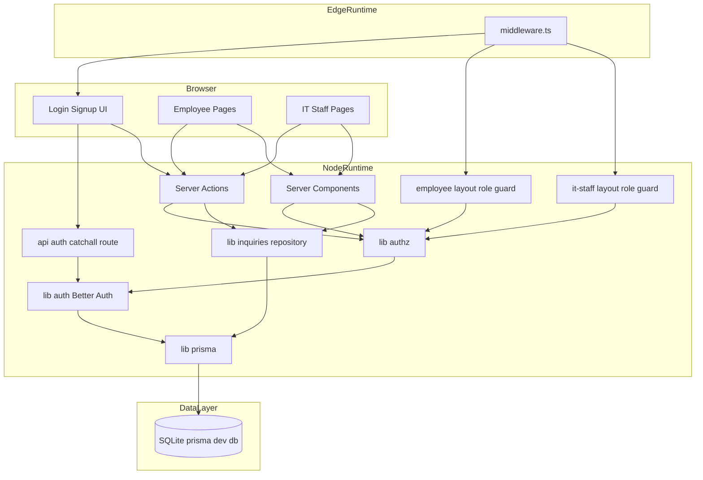
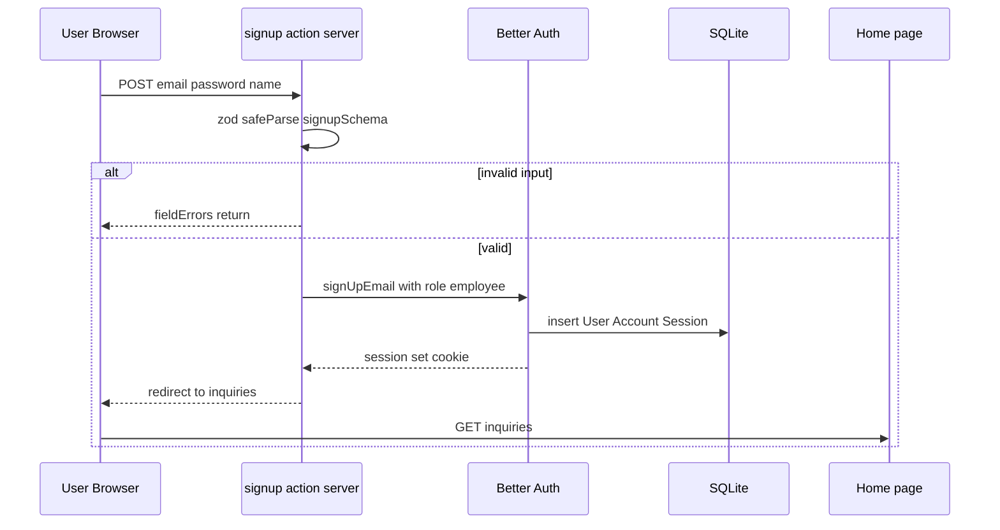
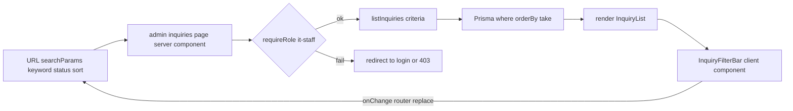
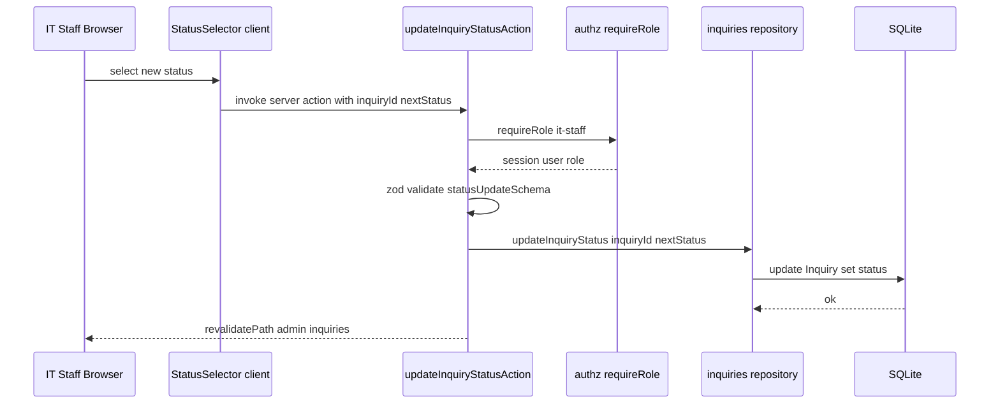
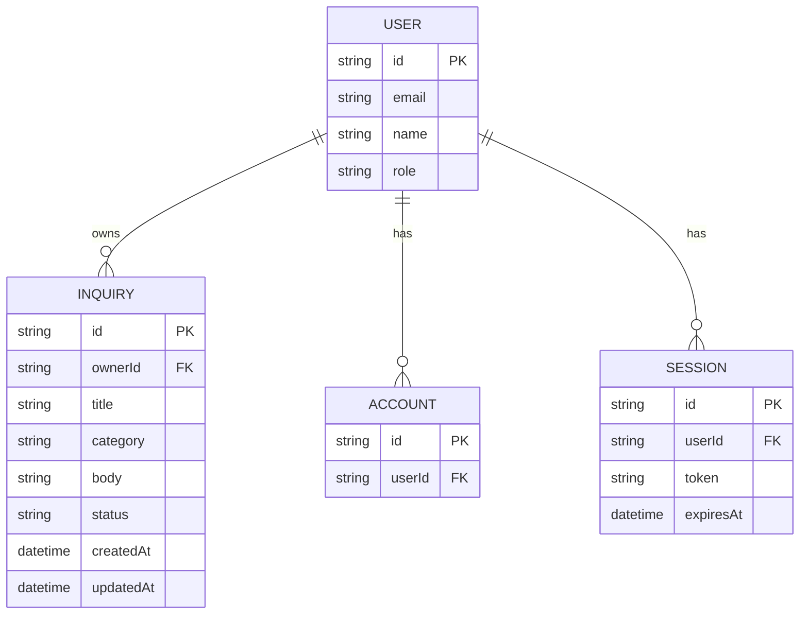

# Design Document — it-inquiry-list

## Overview

**Purpose**: 社内向け IT 問合せの「登録 → 一覧確認 → ステータス更新」を、ロール（社員 / 情シス担当）に応じた最小限の画面と操作で提供する Web アプリケーションを構築する。
**Users**: 社員（依頼者）と情シス担当者（受付・対応者）の 2 種類。社員は自分の問合せ進捗を、情シス担当は全社の問合せ全体像を把握する。
**Impact**: greenfield プロジェクトの最初の機能スペックとして、認証基盤（Better Auth）・データ永続化（Prisma + SQLite）・ロール認可・問合せドメインモデルを土台ごと立ち上げる。

### Goals

- email + password 認証と 2 ロール認可を Better Auth + Prisma で確立する
- 問合せの登録・一覧表示・ステータス更新を Server Components + Server Actions で実装する
- 全件一覧の検索（タイトル・本文部分一致）・フィルタ（ステータス）・ソート（登録日時）を URL 検索パラメータ駆動で実現する
- 後続スペック（通知・SLA・SSO 等）が安全に拡張できる責務境界を確定する

### Non-Goals

- 通知（メール／チャット／Push）、SLA、エスカレーション、自動割当、担当者割当ワークフロー
- 添付ファイル、コメント、回答履歴・差分、監査ログ、操作履歴
- 外部チケットシステム連携（Jira / Zendesk 等）、SSO / MFA / ソーシャルログイン、パスワードリセット、メール検証
- 多テナント、多言語化（日本語 UI のみ）
- SQLite 以外の本番グレード DB 切替（別スペックで扱う）

## Boundary Commitments

### This Spec Owns

- 認証（email + password のサインアップ／ログイン／ログアウト／セッション管理）。Better Auth を本スペックが導入・配線する。
- ロール認可（`employee` / `it-staff` の 2 値、サーバ側ガード、ミドルウェア＋ Layout の 2 段防御）。
- `Inquiry` ドメインのスキーマ定義・CRUD・ステータス遷移。
- 社員向け「自分の問合せ一覧」、情シス向け「全件一覧 + 検索/フィルタ/ソート」の画面と Server Action。
- カテゴリ／ステータスの固定値集合（English keys + 日本語ラベル分離）。
- Prisma スキーマ・SQLite 接続・初期マイグレーション。

### Out of Boundary

- 通知（メール／Slack／Teams／Push）、Webhook、外部連携。
- 添付ファイル保存・スキャン、ファイルストレージ層。
- 担当者割当・コメント・履歴差分・操作監査ログ。
- パスワードリセット／メール検証／MFA／SSO／ソーシャルログイン。
- 多テナント、多言語、PII マスキング、データ保持ポリシー。
- 本番運用向けの DB 切替（Postgres 等）、バックアップ／レプリケーション。
- レート制限・WAF・侵入検知などプラットフォーム横断のセキュリティ施策。

### Allowed Dependencies

- 既存スケルトン: Next.js `16.2.4` / React `19.2.4` / TypeScript `5` / Tailwind CSS `4` / Biome `2.2.0`
- 新規導入: `better-auth ^1.6.9`、`@prisma/client` および `prisma` 最新安定版（SQLite サポート版）、`zod`（最新安定版）
- ランタイム: Node.js（Server Components / Server Actions / Middleware の Edge 部分は Cookie 判定のみ）
- DB ファイル: `prisma/dev.db`（開発／本スペックの利用シナリオ）

依存方向（左 → 右、右から左への import 禁止）:

```
types & labels  →  validation (zod)  →  prisma client  →  inquiries/repository  →  authz  →  Server Actions / Server Components / Layout / Middleware  →  UI components
                                                                                             ↑
                                                                                      auth (Better Auth)
```

### Revalidation Triggers

- `Inquiry`／`User` のスキーマ変更（カラム追加・型変更）
- ステータス値集合（`open` / `in_progress` / `done`）またはカテゴリ値集合の変更
- ロール集合の拡張（`employee` / `it-staff` 以外の追加、または 1 ユーザ複数ロール化）
- 認証ライブラリの差替え（Better Auth → Auth.js 等）またはセッション Cookie の互換性破壊
- DB エンジンの切替（SQLite → Postgres 等）または接続戦略の変更
- Server Actions / API Route の公開契約変更（フィールド名、バリデーション規則）

## Architecture

### Architecture Pattern & Boundary Map

採択パターン: **Next.js 16 App Router + Server Components/Actions + Repository（薄）**。



**Architecture Integration**:

- **Selected pattern**: App Router 標準の Server Components + Server Actions、データアクセスは `lib/inquiries/repository.ts` に集約。
- **Domain/feature boundaries**: 認証ドメイン（`lib/auth.ts` + `app/api/auth/*`）と問合せドメイン（`lib/inquiries/*` + `app/(employee)`／`app/(it-staff)`）を分離。共通の認可ヘルパは `lib/authz.ts` に集める。
- **Existing patterns preserved**: 既存の `app/layout.tsx`、Tailwind 4、Biome の設定はそのまま利用。`@/*` パスエイリアスを継続使用。
- **New components rationale**: `prisma/`（DB）、`lib/`（横断ロジック）、`app/(auth)`／`app/(employee)`／`app/(it-staff)`（Route Group によるロール分離）を新設。
- **Steering compliance**: steering ディレクトリ未整備のため、本スペックが事実上の最初の構造定義。後続スペック向けに依存方向と Route Group 規約をここで確定する。

### Existing Architecture Analysis

- 現状コードベースは `app/layout.tsx` と `app/page.tsx` のみで実装は未着手。`next.config.ts` も空設定。
- パスエイリアス `@/*` → `./*` を `tsconfig.json` で定義済み。本スペックでは `@/lib/...`、`@/prisma/...` を多用する。
- Biome v2 が設定済み（`indentStyle: space, indentWidth: 2`）。生成コードはこの規約に従う。
- ランタイムは Bun（`bun.lock` 存在）。スクリプトは `next dev / build / start`、`biome lint`。
- `app/page.tsx` は Next.js テンプレ初期表示。本スペックでは「未ログインなら /login、ログイン済みならロール別ホームへ redirect」する Server Component に書換える。

### Technology Stack

| Layer | Choice / Version | Role in Feature | Notes |
|-------|------------------|-----------------|-------|
| Frontend | Next.js `16.2.4` / React `19.2.4` / Tailwind CSS `4` | App Router の Server Components で SSR、Tailwind で UI スタイリング | 既存スケルトン踏襲 |
| Auth | `better-auth ^1.6.9` | email + password、セッション、`additionalFields.role` でロール拡張 | CVE-2026-41427 回避のため `>= 1.6.5` 必須、`>= 1.6.9` 推奨 |
| ORM | `prisma` / `@prisma/client`（最新安定版） | スキーマ定義、マイグレーション、Better Auth アダプタ | `prismaAdapter(prisma, { provider: "sqlite" })` |
| DB | SQLite | 開発・社内少人数想定の永続化 | `prisma/dev.db`、`DATABASE_URL=file:./dev.db` |
| Validation | `zod`（最新安定版） | Server Actions の入力検証、エラー構造化 | Better Auth 内部でも Zod 利用、依存重複なし |
| Lint/Format | Biome `2.2.0` | TS/TSX 品質統一 | 既存設定踏襲、追加ルールなし |
| Runtime | Node.js（Server）、Edge（Middleware のみ） | Middleware は Cookie 存在判定のみで Prisma を呼ばない | DB アクセスを伴う認可は Node 側 Layout で実施 |

詳細な選定根拠・代替検討は `research.md` を参照。

## File Structure Plan

### Directory Structure

```
prisma/
├── schema.prisma                         # User Account Session Verification Inquiry の Prisma スキーマ
└── migrations/                           # prisma migrate dev により自動生成
    └── (initial)/migration.sql

lib/
├── prisma.ts                             # Prisma client singleton globalThis cache
├── auth.ts                               # Better Auth サーバインスタンス additionalFields role
├── auth-client.ts                        # createAuthClient クライアント側
├── authz.ts                              # requireUser requireRole ヘルパ Server only
├── validation.ts                         # Zod スキーマ サインアップ ログイン 問合せ ステータス更新
├── format.ts                             # 日時整形ユーティリティ JSX 非依存
└── inquiries/
    ├── types.ts                          # Status Category 列挙 TS const + 型
    ├── labels.ts                         # 日本語ラベル UI からのみ参照
    └── repository.ts                     # listInquiries createInquiry updateInquiryStatus findInquiryById

app/
├── layout.tsx                            # 既存 修正 メタデータ調整 fontvars 維持
├── globals.css                           # 既存
├── page.tsx                              # MODIFY 認証状態に応じてロール別ホームへ redirect
├── middleware.ts                         # NOTE 配置場所はプロジェクト直下が正
│
├── (auth)/                               # Route Group 公開ルート
│   ├── login/
│   │   └── page.tsx                      # ログインフォーム useActionState + Server Action
│   ├── signup/
│   │   └── page.tsx                      # サインアップフォーム
│   └── actions.ts                        # signupAction loginAction logoutAction
│
├── (employee)/                           # Route Group 社員ロール限定
│   ├── layout.tsx                        # role guard requireRole employee 失敗時 redirect
│   └── inquiries/
│       ├── page.tsx                      # 自分の問合せ一覧 Server Component
│       ├── new/
│       │   └── page.tsx                  # 問合せ登録フォーム
│       └── actions.ts                    # createInquiryAction
│
├── (it-staff)/                           # Route Group 情シス担当ロール限定
│   ├── layout.tsx                        # role guard requireRole it-staff
│   └── admin/
│       └── inquiries/
│           ├── page.tsx                  # 全件一覧 + 検索 フィルタ ソート searchParams 駆動
│           └── actions.ts                # updateInquiryStatusAction
│
├── api/
│   └── auth/
│       └── [...all]/
│           └── route.ts                  # Better Auth toNextJsHandler
│
└── components/                           # UI 部品 presentational のみ
    ├── auth/
    │   ├── AuthForm.tsx                  # メール パスワード入力共通フォーム
    │   └── LogoutButton.tsx              # client component signOut 呼び出し
    ├── inquiries/
    │   ├── InquiryForm.tsx               # 問合せ登録フォーム client form
    │   ├── InquiryList.tsx               # 一覧テーブル presentational
    │   ├── InquiryFilterBar.tsx          # キーワード ステータス ソート UI client component
    │   ├── StatusBadge.tsx               # ステータス可視化 presentational
    │   └── StatusSelector.tsx            # 情シス用 inline 変更 client form
    └── ui/
        ├── FieldError.tsx                # Zod エラー表示
        ├── EmptyState.tsx                # 一覧 0 件メッセージ + 導線
        └── Button.tsx                    # 共通ボタン

middleware.ts                             # プロジェクト直下 Edge ランタイム Cookie 判定のみ

.env                                      # DATABASE_URL=file:./dev.db BETTER_AUTH_SECRET=... BETTER_AUTH_URL=http://localhost:3000
```

### Modified Files

- `app/layout.tsx` — タイトル／description を本アプリ向けに変更（`Create Next App` → IT 問合せ管理）。font 設定は維持。
- `app/page.tsx` — テンプレ表示を破棄。Server Component 化し、`auth.api.getSession` でロール判定 → 未ログインは `/login`、`employee` は `/inquiries`、`it-staff` は `/admin/inquiries` へ redirect。
- `next.config.ts` — Better Auth/Prisma 固有設定が必要なら追記（現時点では追加設定なし、必要時に `serverExternalPackages: ["@prisma/client", "better-auth"]` を検討）。
- `package.json` — `dependencies` に `better-auth`、`@prisma/client`、`zod` を追加。`devDependencies` に `prisma` を追加。`scripts` に `db:migrate`、`db:generate` を追加。
- `.gitignore` — `prisma/dev.db*`、`.env`、`.env.local` を確実に除外。

> 各ファイルは単一責務。`lib/inquiries/repository.ts` は Prisma 呼び出しのみを担い、認可判定や Zod 検証は呼び出し側（Server Component / Server Action）で行う。

## System Flows

### サインアップ → 自動ログイン → ホーム遷移



### 全件一覧の検索／フィルタ／ソート（情シス）



### ステータス更新（情シス）



## Requirements Traceability

| Requirement | Summary | Components | Interfaces | Flows |
|-------------|---------|------------|------------|-------|
| 1.1 | サインアップで employee ロール付与 | `signupAction`, `auth` | `signUp.email`, `additionalFields.role` | サインアップフロー |
| 1.2 | 既存メール拒否 | `signupAction`, `auth` | Better Auth `USER_ALREADY_EXISTS` | サインアップフロー |
| 1.3 | パスワードポリシー違反拒否 | `signupAction`, `lib/validation.ts` | `signupSchema`, `auth.emailAndPassword.minPasswordLength=8` | サインアップフロー |
| 1.4 | ログイン成立とロール別遷移 | `loginAction`, `app/page.tsx` | `signIn.email`, redirect | サインアップフロー後段 |
| 1.5 | 認証エラーは汎用メッセージ | `loginAction` | `INVALID_EMAIL_OR_PASSWORD` を一括表示 | — |
| 1.6 | ログアウト | `LogoutButton`, `logoutAction` | `signOut` | — |
| 1.7 | 未ログイン時の保護ページ遮断 | `middleware.ts`, `(employee)/layout.tsx`, `(it-staff)/layout.tsx` | Cookie check + `requireUser` | — |
| 2.1 | ユーザに 1 ロール保持 | `prisma/schema.prisma` `User.role` | `additionalFields.role` | — |
| 2.2 | employee の画面・操作制限 | `(employee)/layout.tsx`, `(it-staff)/layout.tsx` | `requireRole("employee" \| "it-staff")` | — |
| 2.3 | it-staff の画面・操作許可 | `(it-staff)/layout.tsx` | `requireRole("it-staff")` | — |
| 2.4 | 直接呼び出し時の認可拒否 | `updateInquiryStatusAction`, `findInquiryById` 呼び出し時のオーナーチェック | `Authz.requireRole`, `assertOwner` | ステータス更新フロー |
| 2.5 | サーバ側でのロール検証 | `lib/authz.ts` | `requireUser`, `requireRole` | — |
| 3.1 | 登録フォーム表示 | `(employee)/inquiries/new/page.tsx`, `InquiryForm` | — | — |
| 3.2 | カテゴリ固定値 | `lib/inquiries/types.ts`, `labels.ts`, `validation.ts` | `CATEGORY_VALUES`, `inquirySchema` | — |
| 3.3 | 登録 → 永続化 → 通知 | `createInquiryAction`, `repository.createInquiry` | `InquiryRepository.create` | サインアップ後段と共通の redirect/revalidate |
| 3.4 | 入力エラーは項目別表示 + 入力保持 | `InquiryForm`, `createInquiryAction` | `useActionState` + `fieldErrors` | — |
| 3.5 | タイトル 120 / 本文 2000 文字制限 | `lib/validation.ts` | `inquirySchema.title.max(120)`, `body.max(2000)` | — |
| 3.6 | 登録後に自分の一覧に遷移 | `createInquiryAction` | `redirect("/inquiries")` | — |
| 4.1 | 自分の問合せのみ表示 | `(employee)/inquiries/page.tsx`, `repository.listInquiries` | `criteria.ownerId = session.user.id` | — |
| 4.2 | 行に必要項目を表示 | `InquiryList` | props 型 | — |
| 4.3 | 既定ソートは登録日時降順 | `repository.listInquiries` | `orderBy: { createdAt: "desc" }` | — |
| 4.4 | 0 件時のメッセージ + 導線 | `(employee)/inquiries/page.tsx`, `EmptyState` | — | — |
| 4.5 | 他者問合せ詳細への直接 URL 拒否 | `findInquiryById` 呼び出し側のオーナーチェック | `assertOwner(inquiry, sessionUser)` | — |
| 5.1 | 全件一覧の表示項目 | `(it-staff)/admin/inquiries/page.tsx`, `InquiryList` | — | 全件一覧フロー |
| 5.2 | キーワード検索（タイトル・本文部分一致） | `InquiryFilterBar`, `repository.listInquiries` | `criteria.keyword`, Prisma `contains` | 全件一覧フロー |
| 5.3 | ステータスフィルタ | 同上 | `criteria.status` | 全件一覧フロー |
| 5.4 | 登録日時昇降ソート | 同上 | `criteria.sort = "createdAt_asc" \| "createdAt_desc"` | 全件一覧フロー |
| 5.5 | 検索 + フィルタ + ソートを AND 結合 | `repository.listInquiries` | Prisma `where` 合成 | 全件一覧フロー |
| 5.6 | 0 件時のメッセージ + 解除導線 | `EmptyState`, `InquiryFilterBar` | — | — |
| 5.7 | リロード／別タブで条件再現 | URL `searchParams` を Server Component が直接参照 | URL 駆動 | 全件一覧フロー |
| 6.1 | ステータス 3 値固定 | `lib/inquiries/types.ts`, `validation.ts` | `STATUS_VALUES` | — |
| 6.2 | 初期ステータス open | `repository.createInquiry` | `data.status = "open"` | — |
| 6.3 | it-staff のみ更新可能 | `(it-staff)/admin/inquiries/actions.ts`, `authz.requireRole` | — | ステータス更新フロー |
| 6.4 | 更新は社員側にも反映 | `repository.updateInquiryStatus`, `revalidatePath` | `revalidatePath("/inquiries")` を伴う | ステータス更新フロー |
| 6.5 | employee の更新試行は拒否 | `requireRole("it-staff")` | — | ステータス更新フロー |
| 6.6 | 任意の双方向遷移を許可 | `validation.statusUpdateSchema` | 任意の `Status` 値を許容 | ステータス更新フロー |

## Components and Interfaces

| Component | Domain/Layer | Intent | Req Coverage | Key Dependencies (P0/P1) | Contracts |
|-----------|--------------|--------|--------------|--------------------------|-----------|
| `lib/auth.ts` | Auth | Better Auth サーバインスタンス | 1.1, 1.2, 1.3, 1.4, 1.5, 1.6, 2.1 | `prisma` (P0), Better Auth (P0) | Service |
| `lib/authz.ts` | Auth | セッション取得とロール検証ヘルパ | 1.7, 2.2, 2.3, 2.4, 2.5, 4.5 | `auth` (P0) | Service |
| `lib/validation.ts` | Validation | Zod スキーマ集合 | 1.3, 3.4, 3.5, 6.1, 6.6 | `zod` (P0), `lib/inquiries/types` (P0) | Service |
| `lib/inquiries/repository.ts` | Data | 問合せ CRUD と一覧クエリ | 3.3, 4.1, 4.3, 5.2, 5.3, 5.4, 5.5, 6.2, 6.4 | `prisma` (P0), `types` (P0) | Service |
| `app/(auth)/actions.ts` | UI / Action | サインアップ・ログイン・ログアウト | 1.1〜1.6 | `auth` (P0), `validation` (P0) | Service |
| `app/(employee)/inquiries/actions.ts` | UI / Action | 問合せ登録 | 3.3, 3.4, 3.6 | `authz` (P0), `repository` (P0), `validation` (P0) | Service |
| `app/(it-staff)/admin/inquiries/actions.ts` | UI / Action | ステータス更新 | 6.3, 6.4, 6.5 | `authz` (P0), `repository` (P0), `validation` (P0) | Service |
| `app/(employee)/layout.tsx` | UI Guard | 社員ロール画面ガード | 1.7, 2.2 | `authz` (P0) | State |
| `app/(it-staff)/layout.tsx` | UI Guard | 情シスロール画面ガード | 1.7, 2.3 | `authz` (P0) | State |
| `app/(it-staff)/admin/inquiries/page.tsx` | UI Page | 全件一覧 + 絞り込み | 5.1〜5.7 | `authz` (P0), `repository` (P0) | State |
| `app/(employee)/inquiries/page.tsx` | UI Page | 自分の問合せ一覧 | 4.1〜4.4 | 同上 | State |
| `app/(employee)/inquiries/new/page.tsx` | UI Page | 問合せ登録フォーム | 3.1, 3.2, 3.4 | — | — |
| `app/api/auth/[...all]/route.ts` | API | Better Auth エンドポイント | 1.1〜1.6 | `auth` (P0) | API |
| `middleware.ts` | Edge Guard | 未ログイン Cookie 判定で /login へ redirect | 1.7 | Better Auth Cookie 名定数 (P0) | State |
| `components/inquiries/*` | UI | 一覧 / フォーム / バッジ等の presentational | 3.1, 3.2, 4.2, 5.1, 5.2, 5.3, 5.4, 6.3 | UI のみ | — |
| `components/auth/*` | UI | 認証フォーム / ログアウトボタン | 1.4, 1.5, 1.6 | UI のみ | — |
| `components/ui/*` | UI | 共通 UI 部品 | 3.4, 4.4, 5.6 | UI のみ | — |

新たな境界を持たない presentational コンポーネント（`components/**`）は要約行のみで詳細ブロックを省略。以下に新たな境界を持つコンポーネントの詳細を記載する。

### Auth ドメイン

#### `lib/auth.ts`

| Field | Detail |
|-------|--------|
| Intent | Better Auth のサーバインスタンスを生成し、Prisma アダプタとロール拡張フィールドを設定する |
| Requirements | 1.1, 1.2, 1.3, 1.4, 1.5, 1.6, 2.1 |
| Owner / Reviewers | (greenfield – TBD) |

**Responsibilities & Constraints**

- Better Auth の初期化と export（`auth`、`auth.api.getSession`、`toNextJsHandler` で使う `auth.handler`）。
- `additionalFields.role` を `"employee"` 既定値・`required: true`・`input: false` で宣言し、サインアップ経路から外部値での昇格を遮断する。
- `emailAndPassword.requireEmailVerification = false`、`minPasswordLength = 8` を設定。
- 環境変数 `BETTER_AUTH_SECRET`、`BETTER_AUTH_URL` を必須とする。

**Dependencies**

- Outbound: `lib/prisma.ts` — Prisma クライアント注入 (P0)
- External: `better-auth` `^1.6.9`、`better-auth/adapters/prisma` (P0)

**Contracts**: Service [x] / API [ ] / Event [ ] / Batch [ ] / State [ ]

##### Service Interface

```typescript
import type { betterAuth } from "better-auth";

export const auth: ReturnType<typeof betterAuth>;

export type SessionUser = {
  id: string;
  email: string;
  name: string;
  role: "employee" | "it-staff";
};
```

- Preconditions: `prisma` シングルトンが初期化済みであること、`BETTER_AUTH_SECRET` が定義済み。
- Postconditions: サインアップ／ログイン成功時に Set-Cookie が発行され、以降 `auth.api.getSession({ headers })` でセッション取得可能。
- Invariants: `User.role` は常に `"employee"` または `"it-staff"`。

**Implementation Notes**

- Integration: `app/api/auth/[...all]/route.ts` で `toNextJsHandler(auth)` を `GET`/`POST` に export。
- Validation: パスワード長検証は Better Auth が一次、Zod が二次（メッセージ整形目的）。
- Risks: Better Auth マイナーアップデート時のスキーマ追加（カラム新設）に追従が必要 → `prisma migrate dev` を運用手順に含める。

#### `lib/authz.ts`

| Field | Detail |
|-------|--------|
| Intent | Server Components / Actions / Layouts から共通利用するセッション取得・ロール検証ヘルパ |
| Requirements | 1.7, 2.2, 2.3, 2.4, 2.5, 4.5 |

**Responsibilities & Constraints**

- セッション未取得時は `redirect("/login")` で公開エリアへ戻す。
- 期待ロールと実ロールが不一致なら `redirect("/login")` または 403 を返す（Layout は redirect、Action は throw）。
- 所有者ベースの認可（`assertOwner`）はリポジトリ結果に対して行う。

**Contracts**: Service [x] / API [ ] / Event [ ] / Batch [ ] / State [ ]

##### Service Interface

```typescript
import type { SessionUser } from "@/lib/auth";

export type Role = "employee" | "it-staff";

export async function requireUser(): Promise<SessionUser>;

export async function requireRole(role: Role): Promise<SessionUser>;

export function assertOwner(
  resource: { ownerId: string },
  user: SessionUser,
): void; // throws on mismatch
```

- Preconditions: Server Component / Server Action / Layout など Node ランタイム上で呼ばれる。
- Postconditions: 戻り値の `SessionUser` を呼び出し側が以後のクエリ・認可に利用できる。
- Invariants: クライアント側からは import されない（`server-only` import を冒頭に置いて遮断）。

**Implementation Notes**

- Integration: 全ての Layout / Server Action / 一覧 page から本ヘルパ経由でセッションを取得する規律を File Structure Plan で固定化。
- Validation: ロール集合は `lib/inquiries/types.ts` ではなく `lib/authz.ts` 内で `Role` として定義（認可ドメイン）。
- Risks: Edge Middleware 側ではここを呼ばない（Prisma 不可）。Cookie 存在だけで未ログイン判定する役割分担を File Structure Plan で明記。

### Validation ドメイン

#### `lib/validation.ts`

| Field | Detail |
|-------|--------|
| Intent | Zod スキーマで Server Actions 入口の型・制約を一元化 |
| Requirements | 1.3, 3.4, 3.5, 6.1, 6.6 |

**Contracts**: Service [x]

##### Service Interface

```typescript
import { z } from "zod";
import { CATEGORY_VALUES, STATUS_VALUES } from "@/lib/inquiries/types";

export const signupSchema = z.object({
  email: z.string().email(),
  password: z.string().min(8),
  name: z.string().min(1).max(60),
});

export const loginSchema = z.object({
  email: z.string().email(),
  password: z.string().min(1),
});

export const inquirySchema = z.object({
  title: z.string().min(1).max(120),
  category: z.enum(CATEGORY_VALUES),
  body: z.string().min(1).max(2000),
});

export const statusUpdateSchema = z.object({
  inquiryId: z.string().min(1),
  nextStatus: z.enum(STATUS_VALUES),
});

export type SignupInput = z.infer<typeof signupSchema>;
export type LoginInput = z.infer<typeof loginSchema>;
export type InquiryInput = z.infer<typeof inquirySchema>;
export type StatusUpdateInput = z.infer<typeof statusUpdateSchema>;

export type ActionFieldErrors<T> = Partial<Record<keyof T, string>>;

export type ActionState<T> =
  | { status: "idle" }
  | { status: "error"; formError?: string; fieldErrors?: ActionFieldErrors<T> }
  | { status: "success" };
```

**Implementation Notes**

- Integration: 各 Server Action は `safeParse` して `ActionState<T>` を返す。`useActionState` でフォームコンポーネントへ伝搬。
- Validation: ステータス遷移の双方向自由（6.6）は `z.enum(STATUS_VALUES)` のみで満たす。
- Risks: メッセージ文言はコード内で日本語固定（多言語対応は Out of Boundary）。

### 問合せドメイン

#### `lib/inquiries/types.ts`

| Field | Detail |
|-------|--------|
| Intent | ステータス・カテゴリの集合と型を一箇所に固定 |
| Requirements | 3.2, 6.1 |

```typescript
export const STATUS_VALUES = ["open", "in_progress", "done"] as const;
export type Status = (typeof STATUS_VALUES)[number];

export const CATEGORY_VALUES = [
  "hardware",
  "software",
  "account",
  "network",
  "other",
] as const;
export type Category = (typeof CATEGORY_VALUES)[number];

export type Inquiry = {
  id: string;
  ownerId: string;
  title: string;
  category: Category;
  body: string;
  status: Status;
  createdAt: Date;
  updatedAt: Date;
};

export type InquiryWithOwner = Inquiry & {
  owner: { id: string; name: string; email: string };
};

export type InquirySort = "createdAt_desc" | "createdAt_asc";

export type InquiryListCriteria = {
  ownerId?: string;
  status?: Status;
  keyword?: string;
  sort?: InquirySort;
};
```

#### `lib/inquiries/repository.ts`

| Field | Detail |
|-------|--------|
| Intent | Prisma 経由の問合せ CRUD と一覧クエリ。認可は呼び出し側で行う |
| Requirements | 3.3, 4.1, 4.3, 5.2, 5.3, 5.4, 5.5, 6.2, 6.4 |

**Responsibilities & Constraints**

- 一覧は `criteria.ownerId` が指定されればその所有者に限定、`criteria.status` でフィルタ、`criteria.keyword` でタイトル・本文の `contains`、`criteria.sort` で `createdAt` 昇降。
- `createInquiry` は `status: "open"` を強制セット、`updatedAt` は Prisma の `@updatedAt`。
- 認可・所有者チェックは行わない（純粋なデータアクセス）。

**Contracts**: Service [x]

##### Service Interface

```typescript
import type {
  Inquiry,
  InquiryListCriteria,
  InquiryWithOwner,
  Status,
} from "@/lib/inquiries/types";

export async function listInquiries(
  criteria: InquiryListCriteria,
): Promise<InquiryWithOwner[]>;

export async function findInquiryById(
  id: string,
): Promise<InquiryWithOwner | null>;

export async function createInquiry(input: {
  ownerId: string;
  title: string;
  category: string; // Category だが Zod 検証済み前提
  body: string;
}): Promise<Inquiry>;

export async function updateInquiryStatus(
  id: string,
  nextStatus: Status,
): Promise<Inquiry>;
```

- Preconditions: 入力は呼び出し側で Zod 済み。`criteria.keyword` は trim/正規化済み（空文字なら省略扱い）。
- Postconditions: 一覧は `sort` 指定なら指定順、未指定なら `createdAt desc`。
- Invariants: `Inquiry.status` は `STATUS_VALUES` のいずれか（DB 制約はないため、書込み経路は本リポジトリと Zod を経由する規律を守る）。

**Implementation Notes**

- Integration: Server Components / Server Actions のみが本リポジトリを import。`server-only` を冒頭で宣言。
- Validation: `keyword` は SQLite の `LIKE` 互換で `mode: "insensitive"` を Prisma で指定（SQLite は大文字小文字区別あり、Prisma の collation 既定で十分な簡易部分一致を提供）。
- Risks: 大量件数時の全件 SCAN を避けるため将来的に `Inquiry(createdAt)`、`Inquiry(ownerId, createdAt)` の複合 index 追加を検討（本スペック想定規模では不要）。

### Server Actions（UI / Action 層）

#### `app/(auth)/actions.ts`

| Field | Detail |
|-------|--------|
| Intent | サインアップ・ログイン・ログアウトの Server Actions |
| Requirements | 1.1, 1.2, 1.3, 1.4, 1.5, 1.6 |

**Contracts**: Service [x]

##### Service Interface

```typescript
import type { ActionState, SignupInput, LoginInput } from "@/lib/validation";

export async function signupAction(
  prev: ActionState<SignupInput>,
  formData: FormData,
): Promise<ActionState<SignupInput>>;

export async function loginAction(
  prev: ActionState<LoginInput>,
  formData: FormData,
): Promise<ActionState<LoginInput>>;

export async function logoutAction(): Promise<void>;
```

- Preconditions: フォーム経由の `FormData` 受信、Better Auth の Cookie が同一オリジン。
- Postconditions: 成功時に Better Auth のセッション Cookie を Set-Cookie。`signup` / `login` 成功後はロール別ホームへ `redirect`。`logout` は `/login` へ `redirect`。
- Errors: Zod 失敗 → `fieldErrors`。Better Auth の `USER_ALREADY_EXISTS` → `email` フィールドエラー。`INVALID_EMAIL_OR_PASSWORD` → 汎用 `formError`（要件 1.5）。

#### `app/(employee)/inquiries/actions.ts`

| Field | Detail |
|-------|--------|
| Intent | 問合せ登録 Server Action |
| Requirements | 3.3, 3.4, 3.6 |

```typescript
export async function createInquiryAction(
  prev: ActionState<InquiryInput>,
  formData: FormData,
): Promise<ActionState<InquiryInput>>;
```

- Preconditions: `requireRole("employee")` を通過。
- Postconditions: `repository.createInquiry`、`revalidatePath("/inquiries")`、`redirect("/inquiries")`。
- Errors: Zod 失敗 → `fieldErrors` を返し、フォームに値を保持（`useActionState` 経由）。

#### `app/(it-staff)/admin/inquiries/actions.ts`

| Field | Detail |
|-------|--------|
| Intent | 全件一覧上のステータス更新 |
| Requirements | 6.3, 6.4, 6.5, 2.4 |

```typescript
export async function updateInquiryStatusAction(
  prev: ActionState<StatusUpdateInput>,
  formData: FormData,
): Promise<ActionState<StatusUpdateInput>>;
```

- Preconditions: `requireRole("it-staff")` を通過。`statusUpdateSchema` を満たす。
- Postconditions: `repository.updateInquiryStatus`、`revalidatePath("/admin/inquiries")` と `revalidatePath("/inquiries")`（社員側にも反映: 6.4）。
- Errors: 認可失敗時は redirect（Layout で先に弾かれる想定）。Action 内では `requireRole` が throw した場合 `formError` を返す。

### Page / Layout 層

#### `app/(employee)/layout.tsx` / `app/(it-staff)/layout.tsx`

| Field | Detail |
|-------|--------|
| Intent | Route Group 全体のロールガード |
| Requirements | 1.7, 2.2, 2.3 |

**Responsibilities & Constraints**

- 各 Layout 冒頭で `requireRole("employee" | "it-staff")` を呼ぶ。
- 共通ヘッダ（ユーザ名表示・ログアウトボタン）を含む。

#### `app/(it-staff)/admin/inquiries/page.tsx`

| Field | Detail |
|-------|--------|
| Intent | 全件一覧 + 検索／フィルタ／ソート |
| Requirements | 5.1, 5.2, 5.3, 5.4, 5.5, 5.6, 5.7, 6.3 |

**Responsibilities & Constraints**

- `searchParams: { keyword?: string; status?: string; sort?: string }` を受け取り、`InquiryListCriteria` に正規化（不正値は無視）。
- `repository.listInquiries(criteria)` を呼び、`InquiryList`（presentational）と `InquiryFilterBar`（client）に分割描画。
- 0 件時は `EmptyState` で「条件解除」リンク（クエリ無し URL へ）を提示。

#### `middleware.ts`

| Field | Detail |
|-------|--------|
| Intent | Edge ランタイムでの未ログイン判定 |
| Requirements | 1.7 |

**Responsibilities & Constraints**

- パス `/inquiries`、`/admin/...` に対し、Better Auth のセッション Cookie（`better-auth.session_token` 等の標準名）が存在しない場合 `/login` へ rewrite/redirect。
- ロール判定は行わない（Edge から DB に触れないため）。
- `/api/auth/*`、`/login`、`/signup` は除外。

**Contracts**: State [x]

## Data Models

### Domain Model



- Aggregate: `User`（aggregate root）と `Inquiry`（aggregate root、`ownerId` で User を参照）。
- Domain rules:
  - `Inquiry.status ∈ {"open", "in_progress", "done"}`、初期値 `"open"`。任意値間の遷移を許容（要件 6.6）。
  - `Inquiry.category ∈ CATEGORY_VALUES`。
  - `User.role ∈ {"employee", "it-staff"}`、サインアップ経路から外部値の上書き不可（`additionalFields.input: false`）。

### Logical Data Model

- リレーション: `Inquiry.ownerId` → `User.id`、`onDelete: Cascade`（社員退職時のデータ整理は本スペック範囲外だが、参照整合のためカスケード）。
- 自然キー: `User.email` は unique。`Inquiry` は代理キー（`cuid`）のみ。
- インデックス: 想定規模では Prisma 既定 + 主キー／unique のみ。スケール時に `Inquiry(ownerId, createdAt)` および `Inquiry(createdAt)` 追加を検討（research.md 参照）。

### Physical Data Model — Prisma Schema（抜粋）

```prisma
generator client {
  provider = "prisma-client-js"
}

datasource db {
  provider = "sqlite"
  url      = env("DATABASE_URL")
}

model User {
  id            String    @id @default(cuid())
  email         String    @unique
  name          String
  role          String    @default("employee")
  emailVerified Boolean   @default(false)
  image         String?
  createdAt     DateTime  @default(now())
  updatedAt     DateTime  @updatedAt
  accounts      Account[]
  sessions      Session[]
  inquiries     Inquiry[]
}

model Account {
  id           String   @id @default(cuid())
  accountId    String
  providerId   String
  userId       String
  user         User     @relation(fields: [userId], references: [id], onDelete: Cascade)
  password     String?
  createdAt    DateTime @default(now())
  updatedAt    DateTime @updatedAt
  @@unique([providerId, accountId])
}

model Session {
  id        String   @id @default(cuid())
  userId    String
  user      User     @relation(fields: [userId], references: [id], onDelete: Cascade)
  token     String   @unique
  expiresAt DateTime
  ipAddress String?
  userAgent String?
  createdAt DateTime @default(now())
  updatedAt DateTime @updatedAt
}

model Verification {
  id         String   @id @default(cuid())
  identifier String
  value      String
  expiresAt  DateTime
  createdAt  DateTime @default(now())
  updatedAt  DateTime @updatedAt
}

model Inquiry {
  id        String   @id @default(cuid())
  ownerId   String
  owner     User     @relation(fields: [ownerId], references: [id], onDelete: Cascade)
  title     String
  category  String
  body      String
  status    String   @default("open")
  createdAt DateTime @default(now())
  updatedAt DateTime @updatedAt
  @@index([ownerId, createdAt])
  @@index([createdAt])
}
```

> Better Auth が要求する `User`/`Account`/`Session`/`Verification` のフィールドは公式スキーマ生成出力に整合させる。実値は `npx @better-auth/cli generate` で再生成可能。

### Data Contracts & Integration

- Server Actions の入出力は本ドキュメントの `Service Interface` に従う。外部 API は公開しない。
- API 経路は `app/api/auth/[...all]/route.ts` のみ（Better Auth 専用）。シリアライズは Better Auth が JSON で行う。

## Error Handling

### Error Strategy

| カテゴリ | 例 | ハンドリング |
|----------|----|--------------|
| 入力エラー（4xx 相当） | Zod 検証失敗、必須未入力 | `ActionState.fieldErrors` を返却し、フォームに値保持（要件 3.4） |
| 認証失敗 | メール／パスワード不一致、未登録メール | 汎用 `formError`「メールアドレスまたはパスワードが正しくありません」（要件 1.5） |
| 認可失敗（Layout 段） | 未ログインで保護ページ直叩き、ロール不一致 | `redirect("/login")`（要件 1.7、2.2、2.3、2.4） |
| 認可失敗（Action 段） | 直接 Action 呼出しで権限不足 | `requireRole` が throw → `formError`「操作権限がありません」 |
| 業務エラー | 重複メールでサインアップ | Better Auth `USER_ALREADY_EXISTS` を `email` フィールドエラーへマップ（要件 1.2） |
| システムエラー | DB 障害、想定外例外 | `formError`「処理に失敗しました。時間をおいて再試行してください」、サーバログに詳細 |

### Monitoring

- 開発フェーズでは `console.error` で十分。本番運用に進める段階で観測基盤導入を別スペック化する（Out of Boundary）。

## Testing Strategy

### Unit Tests

- `lib/validation.ts`: `signupSchema` / `loginSchema` / `inquirySchema` / `statusUpdateSchema` の境界値（タイトル 0/120/121 文字、本文 0/2000/2001 文字、無効カテゴリ／ステータス）。要件 1.3、3.5、6.1。
- `lib/inquiries/repository.ts`: `listInquiries` の `criteria` 組み合わせ（ownerId 有無、status、keyword、sort）→ Prisma 呼び出しが意図通り（in-memory SQLite or mocked Prisma）。要件 4.1、5.2〜5.5、4.3。
- `lib/authz.ts`: `requireRole` 不一致時の挙動、`assertOwner` の throw 条件。要件 2.4、2.5、4.5。
- `lib/inquiries/types.ts`: `STATUS_VALUES` / `CATEGORY_VALUES` が `Status` / `Category` 型と一致することを `as const` の型テストで担保。

### Integration Tests

- サインアップ → 自動ログイン → `/inquiries` へ遷移の Server Action パス（`app/(auth)/actions.ts`）。要件 1.1、1.4、1.7。
- 問合せ登録 Server Action: 入力エラー時の `fieldErrors` と入力保持、成功時の `redirect`/`revalidatePath`。要件 3.3、3.4、3.6。
- ステータス更新 Server Action: it-staff 成立時の更新と社員側への反映（`revalidatePath("/inquiries")`）、employee 試行時の拒否。要件 6.3、6.4、6.5、2.4。
- 全件一覧の `searchParams` → 一覧結果（keyword + status + sort の AND 結合）。要件 5.5、5.7。

### E2E / UI Tests（推奨、Playwright 等で本スペック完了直前に実施）

- 社員フロー: サインアップ → 問合せ登録 → 自分の一覧で確認 → ステータスが `受付済` で表示。要件 1.1、3.1〜3.6、4.1〜4.4。
- 情シスフロー: 既存 `it-staff` ユーザでログイン → 全件一覧で対象問合せをキーワード検索 → ステータスを `対応中` に変更 → 社員側で再ロードして反映確認。要件 5.1〜5.7、6.3、6.4。
- 認可フロー: 社員が `/admin/inquiries` を直接 URL でアクセス → ログイン画面へリダイレクト。要件 2.2、2.4。
- 0 件 UI: 一覧 0 件時の `EmptyState` 表示と「条件解除」導線。要件 4.4、5.6。

### Performance / Load

- 本スペックでは社内・少人数想定のため明示的な負荷テストは不要。将来切替時の指標は後続スペックで定義。

## Security Considerations

- パスワード保管・セッション・CSRF は Better Auth 提供の標準実装に依拠（独自実装しない）。
- ロール昇格防止: `additionalFields.role` に `input: false` を必ず付与し、API 経由で外部値による role 上書きを禁止する。
- 認可は「Edge Middleware（Cookie 存在判定）」＋「Layout/Action（DB セッション + ロール判定）」の 2 段構え。Edge だけで完結させない。
- 環境変数は `.env`（`.gitignore` 済み）。`BETTER_AUTH_SECRET` は十分なエントロピーを持たせる。
- 検索キーワードは Prisma パラメータバインディング経由で SQL に渡るため、SQL インジェクション耐性は ORM 標準で確保。
- セッション Cookie は Better Auth 既定（`HttpOnly`, `SameSite=Lax`, `Secure` は本番）。

## Migration Strategy

greenfield のため移行はなく、初期セットアップ手順のみ:

1. `bun add better-auth @prisma/client zod`、`bun add -d prisma`
2. `npx prisma init --datasource-provider sqlite` → `prisma/schema.prisma` を本スペックの定義に置換
3. `npx prisma migrate dev --name init` で `prisma/dev.db` 生成
4. `.env` に `DATABASE_URL=file:./dev.db`、`BETTER_AUTH_SECRET=<random>`、`BETTER_AUTH_URL=http://localhost:3000`
5. it-staff の初期投入は seed スクリプト（`prisma/seed.ts`）または DB 直接更新で行う（運用手順）。

## Supporting References

- `.kiro/specs/it-inquiry-list/brief.md` — Approach 3 採択経緯と viability check の根拠
- `.kiro/specs/it-inquiry-list/requirements.md` — 本設計が満たすべき要件 ID
- `.kiro/specs/it-inquiry-list/research.md` — 設計判断の代替案・トレードオフの詳細
